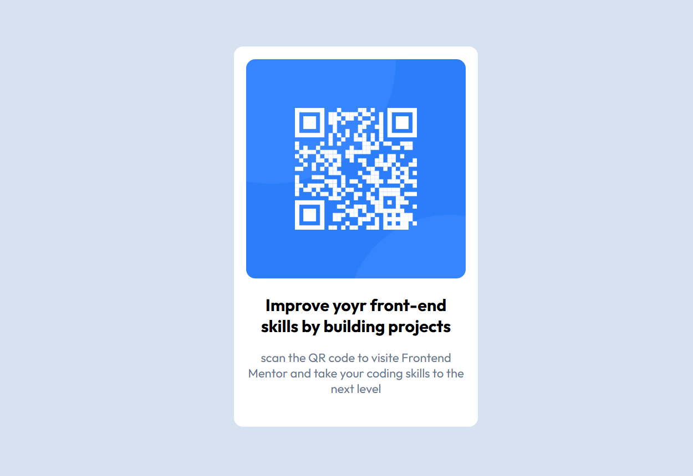

# Trilha_frontend_Mentor
 - Este repositório foi criado para servir como uma trilha de aprendizado, reunindo todos os desafios realizados no site Frontend Mentor em um único local. O objetivo é consolidar conhecimentos, organizar os projetos e acompanhar a evolução ao longo do tempo.

 Você pode acessar: [Clique aqui.](https://davi-devroom.github.io/Trilha_frontend_Mentor/)

 
### 1° Desafio: Componente QR-Code
---
- O primeiro projeto consiste em criar uma tela de captura com um QR Code que redireciona para o site de desafios Frontend Mentor.

As ferramentas utilizadas foram: HTML e CSS.

### 2° Desafio: Cartão de pré-visualização do blog
---
- Esse projeto consiste em criar um card de pré-visualização de um blog pessoal.

As ferramentas utilizadas foram: HTML e CSS.

### 3° Desafio: Página de Links sociais
---
- Este projeto é uma página com botões de redirecionamento para outras redes sociais, semelhante ao Linktree, amplamente utilizado em plataformas digitais.

As ferramentas utilizadas foram: HTML e CSS.

### 4° Desafio: Página de receitas
---
- Este é um projeto mais amplo: uma página de receitas semelhante a um livro de receitas digital. Ele apresenta o passo a passo de uma receita, incluindo a lista de ingredientes e o modo de preparo. Um projeto um pouco mais dificil que os outros, abordando conceitos de tabela para a separação dos dados nutricionais.

As ferramentas utilizadas foram: HTML e CSS.

### 4° Desafio: Componente de cartão de visualização do produto
---
- Este projeto simula a página de um produto onde é essencial a responsividade com relação a tela e a ação visual no botão para demonstrar que o produto teria sido adicionado ao carrinho.

As ferramentas utilizadas foram: HTML e CSS.

